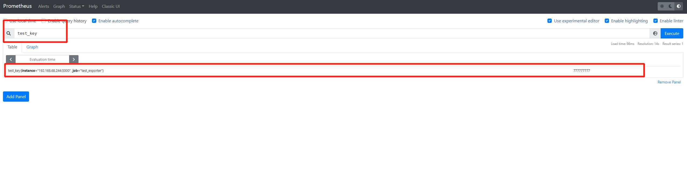

### 项目介绍
1. alibaba cloud prometheus exporter 开发示例代码
2. 可以基于该功能扩展其他功能
3. **[prometheus writing_exporters](https://prometheus.io/docs/instrumenting/writing_exporters/)**
4. **[aliyun-openapi-python-sdk](https://github.com/aliyun/aliyun-openapi-python-sdk)**

### 食用方法
1. 安装组件
```shell
pip install -r requirements.txt
```
2. 添加 apikey
```
base.py

    self.apikey = ''
    self.secret = ''

```
3. 启动服务
```shell
python -m flask run --host=192.168.68.244
```
3. prometheus.yml 添加以下配置
```yml
  - job_name: "test_exporter"
    static_configs:
      - targets: ["192.168.68.244:5000"]
```
4. 查看 metrics
```shell
curl http://192.168.68.244/metrics
```
5. 访问 prometheus web 检索


### 已添加
```
aliyun_balance 0.00
aliyun_expired_ecs_count 0
aliyun_expired_rds_count 0
```

### 如何开发
代码很简洁，看一下就会二开了。